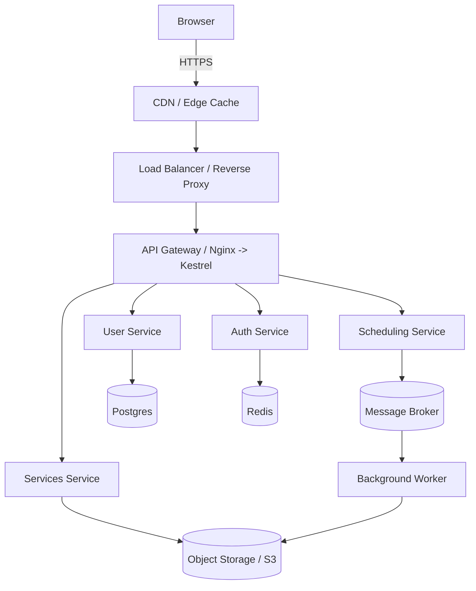
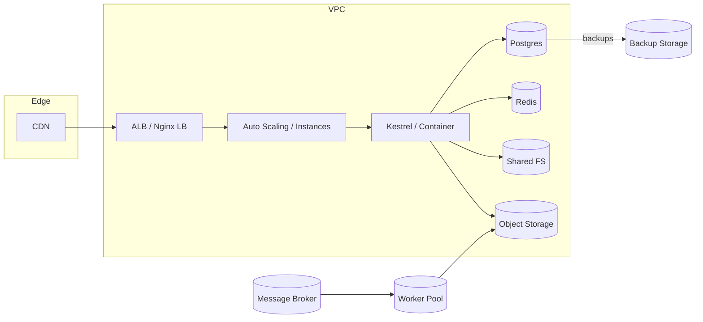
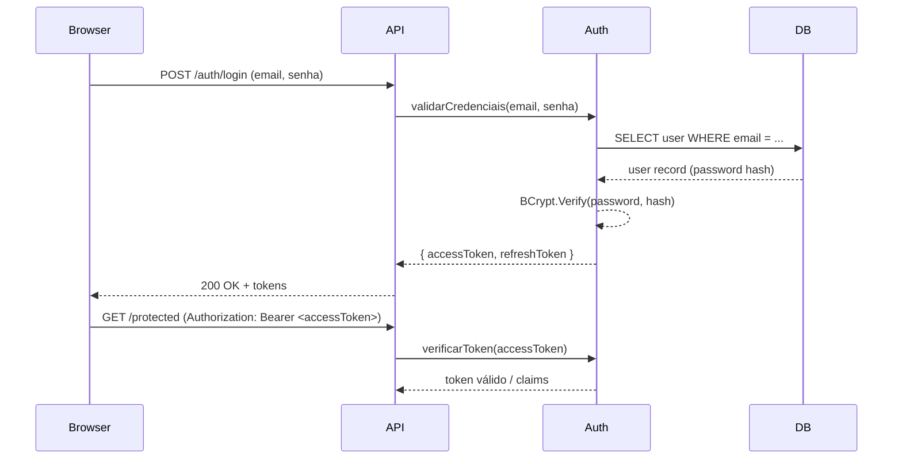
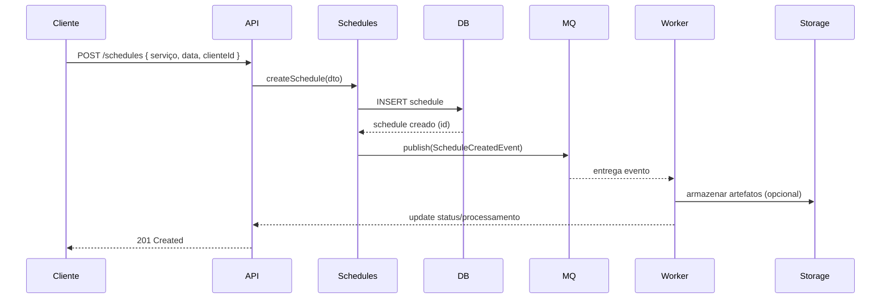

# API Barbearia - Portfólio

API REST construída em .NET 9 para gerenciar uma barbearia/portfólio — autenticação por JWT, segurança de senhas com BCrypt e banco de dados PostgreSQL. Projetada para ser executada em VPS (via Docker ou diretamente com Kestrel + Nginx). Fornece endpoints para autenticação, usuários, serviços, agendamentos e gerenciamento de portfólio.

[]()
[]()
[]()

Sumário
- [Visão Geral](#visão-geral)
- [Principais Tecnologias](#principais-tecnologias)
- [Funcionalidades](#funcionalidades)
- [Arquitetura e Diagramas (Mermaid)](#arquitetura-e-diagramas-mermaid)
  - [Visão Geral da Arquitetura (flowchart)](#visão-geral-da-arquitetura-flowchart)
  - [Implantação / Infra (graph LR)](#implantação--infra-graph-lr)
  - [Fluxo de Autenticação (sequenceDiagram)](#fluxo-de-autenticação-sequencediagram)
  - [Fluxo de Agendamento (sequenceDiagram)](#fluxo-de-agendamento-sequencediagram)
- [Organização do Código](#organização-do-código)
- [Requisitos](#requisitos)
- [Instalação e Execução Local](#instalação-e-execução-local)
  - [1. Clonar o repositório](#1-clonar-o-repositório)
  - [2. Variáveis de ambiente / appsettings](#2-variáveis-de-ambiente--appsettings)
  - [3. Migrations e banco de dados](#3-migrations-e-banco-de-dados)
  - [4. Executar localmente](#4-executar-localmente)
- [Docker / Docker Compose (Desenvolvimento e Produção)](#docker--docker-compose-desenvolvimento-e-produção)
- [Deploy em VPS (guia recomendado)](#deploy-em-vps-guia-recomendado)
  - [Opção A: Docker Compose (recomendado)](#opção-a-docker-compose-recomendado)
  - [Opção B: Kestrel + Nginx (sem Docker)](#opção-b-kestrel--nginx-sem-docker)
- [Segurança](#segurança)
  - [JWT](#jwt)
  - [BCrypt](#bcrypt)
  - [Boas práticas para segredos](#boas-práticas-para-segredos)
- [Banco de Dados](#banco-de-dados)
  - [Backups e restauração](#backups-e-restauração)
- [Documentação da API (endpoints principais)](#documentação-da-api-endpoints-principais)
  - [Autenticação](#autenticação)
  - [Usuários](#usuários)
  - [Serviços](#serviços)
  - [Agendamentos](#agendamentos)
  - [Portfólio / Imagens](#portfólio--imagens)
- [Testes](#testes)
- [Observabilidade e Saúde](#observabilidade-e-saúde)
- [Resolução de problemas comuns](#resolução-de-problemas-comuns)
- [Contribuição](#contribuição)
- [Licença](#licença)
- [Contato / Suporte](#contato--suporte)

---

## Visão Geral

Este projeto é uma API backend para gerenciar uma barbearia/portfólio com:
- Autenticação e autorização com JWT (access + refresh tokens).
- Senhas armazenadas com BCrypt.
- Persistência em PostgreSQL usando Entity Framework Core.
- Configuração para rodar em VPS (Docker ou Kestrel + Nginx).
- Documentação via Swagger (Swashbuckle).
- Logs estruturados (ex.: Serilog) e endpoints de health-check.

Objetivo: fornecer um backend robusto, seguro e fácil de implantar, servindo tanto para um portfólio pessoal quanto para um MVP de produto.

## Principais Tecnologias

- .NET 9 (C#)
- Entity Framework Core (EF Core)
- PostgreSQL
- JWT (System.IdentityModel ou bibliotecas compatíveis)
- BCrypt (via BCrypt.Net-Next ou similar)
- Docker & Docker Compose
- Nginx (reverse proxy) + Certbot (Let's Encrypt) para HTTPS
- Swagger / OpenAPI
- Serilog (opcional)
- GitHub Actions (opcional para CI/CD)

## Funcionalidades

- Registro de usuário (hash de senha com BCrypt).
- Login com emissão de JWT (access token curto + refresh token).
- Refresh de token e revogação.
- CRUD de perfis/usuários (roles: User, Admin).
- CRUD de serviços (ex.: cortes, barba).
- Agendamento de serviços (criar, atualizar, cancelar).
- Upload/gerenciamento de imagens do portfólio (armazenamento local ou S3).
- Filtros, paginação e ordenação em endpoints listáveis.
- Migrations automatizadas com EF Core.
- Swagger UI disponível em /swagger (em ambiente de desenvolvimento).

## Arquitetura e Diagramas (Mermaid)

Abaixo estão diagramas Mermaid incorporados para explicar a arquitetura, implantação e fluxos principais. Após cada diagrama há uma breve descrição (fallback textual) para acessibilidade ou renderizadores que não suportam Mermaid.

### Visão Geral da Arquitetura (flowchart)



Descrição:
- Browser usa HTTPS para falar com a CDN/Load Balancer.
- Nginx atua como reverse proxy encaminhando para Kestrel (API).
- API roteia para módulos/serviços internos (Auth, Users, Services, Schedules).
- Banco relacional (Postgres) guarda entidades principais; Redis para caches/tokens.
- Processos assíncronos são realizados por Workers via Message Broker; uploads em Object Storage.

### Implantação / Infra (graph LR)



Descrição:
- CDN + Load Balancer na borda, instâncias (ou containers) executam Kestrel.
- Postgres, Redis e object storage para persistência e arquivos.
- Broker e Workers para processamento background.

### Fluxo de Autenticação (sequenceDiagram)



Descrição:
- Auth valida credenciais consultando o DB e comparando hash com BCrypt.
- Auth retorna access + refresh tokens; API valida tokens para chamadas subsequentes.

### Fluxo de Agendamento (sequenceDiagram)



Descrição:
- Criação do agendamento persiste no DB e publica um evento no broker para processamento assíncrono (notificações, reminders, geração de arquivos etc).

Observação sobre renderização:
- Se o visualizador não suportar Mermaid, o bloco acima aparecerá como código-fonte Mermaid. Forneci descrições textuais para cada diagrama.

## Organização do Código

Estrutura sugerida:
- src/
  - Api/ (projeto WebAPI)
  - Domain/ (entidades, enums, regras)
  - Application/ (DTOs, serviços de aplicação, interfaces)
  - Infrastructure/ (EF Core, Migrations, repositórios, implementações de I/O)
  - Shared/ (utilitários, constantes)
  - Tests/ (testes unitários e integração)
- docker/
  - docker-compose.yml
  - Dockerfile
- scripts/
  - deploy, backup, restore helpers

Padrões:
- DTOs para entrada/saída.
- Repositório + Unit of Work (opcional).
- Services (camada de aplicação) para lógica de orquestração.
- AutoMapper para mapping entre entidades e DTOs.
- Middlewares para autenticação/autorização e tratamento global de exceções.

## Requisitos

Local:
- .NET 9 SDK (dotnet 9.x)
- dotnet-ef (CLI) — opcional para gerar e aplicar migrations
- PostgreSQL (local ou container)
- Docker & Docker Compose (opcional)
- Git

VPS:
- Docker + Docker Compose OR .NET 9 Runtime + Nginx
- Certbot (para HTTPS) caso use Nginx

## Instalação e Execução Local

### 1. Clonar o repositório

```bash
git clone https://github.com/alonesch/api-barbearia-portifolio.git
cd api-barbearia-portifolio
```

### 2. Variáveis de ambiente / appsettings

Crie um arquivo `.env` (ou use `appsettings.Development.json`/user-secrets). Exemplo de variáveis:

```env
ASPNETCORE_ENVIRONMENT=Development
ASPNETCORE_URLS=http://*:5000

# Database (Postgres)
ConnectionStrings__DefaultConnection=Host=localhost;Port=5432;Database=barbearia_db;Username=barber;Password=supersecret

# JWT
JWT__Key=troca-por-uma-chave-muito-secreta-e-longa
JWT__Issuer=ApiBarbearia
JWT__Audience=ApiBarbeariaClient
JWT__ExpiresMinutes=15
JWT__RefreshTokenExpiresDays=7

# BCrypt
BCRYPT__WorkFactor=12

# Storage (opcional)
STORAGE__Provider=local
STORAGE__Local__Path=./uploads

# Outros
LOG__Level=Information
```

> Atenção: Nunca versionar segredos em repositórios públicos. Use secrets do GitHub Actions ou variáveis de ambiente no servidor.

### 3. Migrations e banco de dados

Instale o CLI do EF caso necessário:

```bash
dotnet tool install --global dotnet-ef
```

Criar migrations (se alterações locais):

```bash
dotnet ef migrations add InitialCreate --project src/Infrastructure --startup-project src/Api
```

Aplicar migrations:

```bash
dotnet ef database update --project src/Infrastructure --startup-project src/Api
```

Ou inicialize o banco via container (ver Docker Compose abaixo).

### 4. Executar localmente

```bash
cd src/Api
dotnet restore
dotnet build
dotnet run --urls "http://localhost:5000"
```

Acesse:
- API: http://localhost:5000
- Swagger (Development): http://localhost:5000/swagger

## Docker / Docker Compose (Desenvolvimento e Produção)

Exemplo simplificado `docker/docker-compose.yml`:

```yaml
version: "3.8"
services:
  db:
    image: postgres:15
    restart: always
    environment:
      POSTGRES_USER: barber
      POSTGRES_PASSWORD: supersecret
      POSTGRES_DB: barbearia_db
    volumes:
      - db-data:/var/lib/postgresql/data
    ports:
      - "5432:5432"

  redis:
    image: redis:7
    restart: always
    ports:
      - "6379:6379"

  api:
    build:
      context: .
      dockerfile: Dockerfile
    restart: always
    environment:
      - ASPNETCORE_ENVIRONMENT=Production
      - ConnectionStrings__DefaultConnection=Host=db;Port=5432;Database=barbearia_db;Username=barber;Password=supersecret
      - JWT__Key=${JWT__Key}
    depends_on:
      - db
      - redis
    ports:
      - "5000:80"
    volumes:
      - ./uploads:/app/uploads

volumes:
  db-data:
```

Notas:
- Em produção, utilize secrets/variáveis de ambiente seguras (Docker secrets, Vault, etc).
- Ajuste recursos (replicas, healthchecks, limites) conforme necessário.

## Deploy em VPS (guia recomendado)

### Opção A: Docker Compose (recomendado)
- Instale Docker + Docker Compose na VPS.
- Transfira os arquivos (`docker-compose.yml`, `Dockerfile`, `.env`) para o servidor.
- Configure proxy reverso (Nginx) à frente do serviço ou exponha porta 80/443 no container.
- Use Certbot para TLS com Nginx ou configure um container com Traefik.
- Exemplo de comandos:

```bash
docker compose pull
docker compose up -d --build
docker compose logs -f api
```

### Opção B: Kestrel + Nginx (sem Docker)
- Publicar a aplicação: `dotnet publish -c Release -o /var/www/api`
- Configurar systemd unit para o processo `dotnet`.
- Configurar Nginx como reverse proxy (proxy_pass -> http://localhost:5000).
- Usar Certbot para obter TLS.

Exemplo de bloco Nginx (simplificado):

```nginx
server {
    listen 80;
    server_name api.seudominio.com;

    location / {
        proxy_pass http://127.0.0.1:5000;
        proxy_http_version 1.1;
        proxy_set_header Host $host;
        proxy_set_header X-Forwarded-For $proxy_add_x_forwarded_for;
        proxy_set_header X-Forwarded-Proto $scheme;
    }
}
```

## Segurança

### JWT
- Use uma chave (JWT__Key) forte e longa.
- Access tokens curtos (ex.: 15 minutos) e refresh tokens mais longos.
- Salve refresh tokens com mecanismos de revogação (DB) e rotacione quando usado.

### BCrypt
- WorkFactor configurável (ex.: 12) para balancear segurança/performance.
- Nunca armazenar senhas em texto plano.

### Boas práticas para segredos
- Use variáveis de ambiente, Docker secrets, HashiCorp Vault ou GitHub Secrets.
- Não deixar chaves no repositório.
- Rotacione segredos periodicamente.

## Banco de Dados

- Modelagem via EF Core migrations.
- Indíces para consultas de agendamentos e buscas por usuário/serviço.
- Use conexões seguras (SSL) entre API e Postgres em produção.

### Backups e restauração
- Agende dumps regulares (pg_dump) ou snapshots do volume.
- Teste restaurações periodicamente.

Exemplo simples de backup:

```bash
PGPASSWORD=supersecret pg_dump -h localhost -U barber -Fc barbearia_db > backup-$(date +%F).dump
```

Restauração:

```bash
pg_restore -h localhost -U barber -d barbearia_db --clean backup-2025-12-30.dump
```

## Documentação da API (endpoints principais)

A documentação completa está disponível via Swagger (quando habilitado). Abaixo alguns endpoints principais e exemplos.

### Autenticação
- POST /api/auth/register
  - Body: { name, email, password }
  - Retorna: usuário + tokens (optional)
- POST /api/auth/login
  - Body: { email, password }
  - Retorna: { accessToken, refreshToken }
- POST /api/auth/refresh
  - Body: { refreshToken }
- POST /api/auth/logout
  - Revoga refresh token

### Usuários
- GET /api/users
- GET /api/users/{id}
- POST /api/users (Admin)
- PUT /api/users/{id}
- DELETE /api/users/{id}

### Serviços
- GET /api/services
- GET /api/services/{id}
- POST /api/services (Admin)
- PUT /api/services/{id}
- DELETE /api/services/{id}

### Agendamentos
- GET /api/schedules
- GET /api/schedules/{id}
- POST /api/schedules
- PUT /api/schedules/{id}
- DELETE /api/schedules/{id}
- Endpoints com filtros (data, profissional, status), paginação e ordenação.

### Portfólio / Imagens
- POST /api/portfolio (upload de imagem)
- GET /api/portfolio
- DELETE /api/portfolio/{id}
- Armazenamento local (uploads/) ou provider S3 (configurável em appsettings).

## Testes

- Estrutura para testes unitários e de integração em `src/Tests`.
- Recomenda-se usar xUnit + FluentAssertions + Moq.
- Para testes de integração, use um banco Postgres containerizado (testcontainers ou docker compose) e aplicar migrations no setup.

Exemplo (dotnet):

```bash
cd src/Tests
dotnet test
```

## Observabilidade e Saúde

- Expor endpoints de health-check: `/health` (readiness, liveness).
- Logs estruturados (Serilog) com sink para arquivos/Elastic/Kibana opcional.
- Métricas (Prometheus) e trace (OpenTelemetry) podem ser adicionados conforme necessidade.

## Resolução de problemas comuns

- Migration falhando: checar string de conexão e permissões do DB.
- Erros de upload: validar permissões de diretório uploads/ ou credenciais S3.
- Token inválido: verificar relógio do servidor (NTP) e chave JWT.
- Problemas de domínio/HTTPS: conferir configuração do Nginx/Certbot e portas no firewall.

## Contribuição

Contribuições são bem-vindas:
- Abra issues para bugs e features.
- Use PRs com descrições claras e referência a issues.
- Mantenha padrões de código, testes e documentação atualizados.

## Licença

Projeto licenciado sob MIT. Veja o arquivo LICENSE para mais detalhes.

## Contato / Suporte

Para dúvidas ou suporte, abra uma issue no repositório ou contate o mantenedor: alonesch.

---

Se quiser que eu:
- faça o commit desse README no repositório (me informe owner/repo e branch),
- gere SVGs dos diagramas e adicione em /docs/assets/,
- ou ajuste os diagramas para uma arquitetura específica (por exemplo: monolito vs microserviços, uso de S3 vs local),
posso executar esses passos — diga qual você prefere.